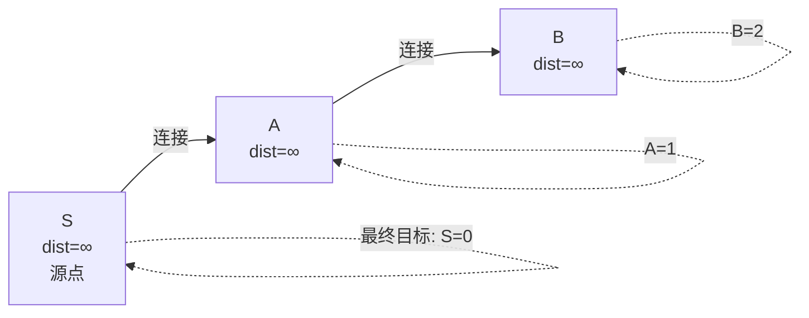
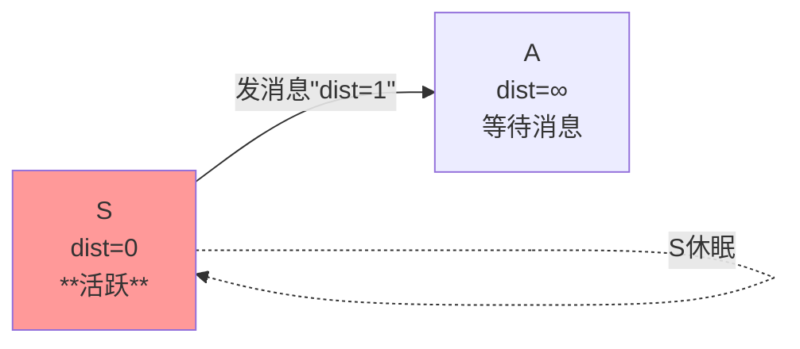
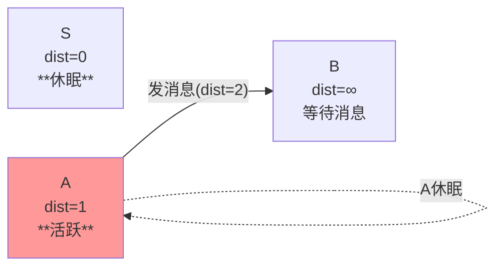
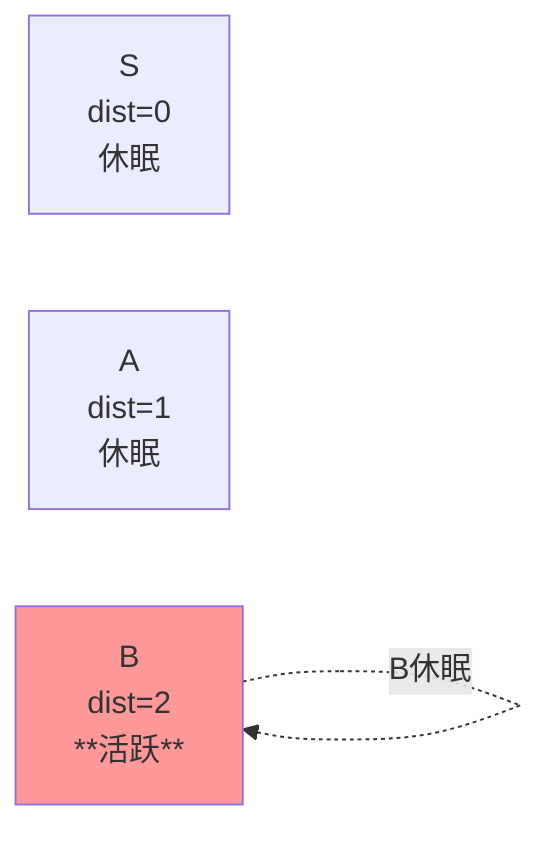
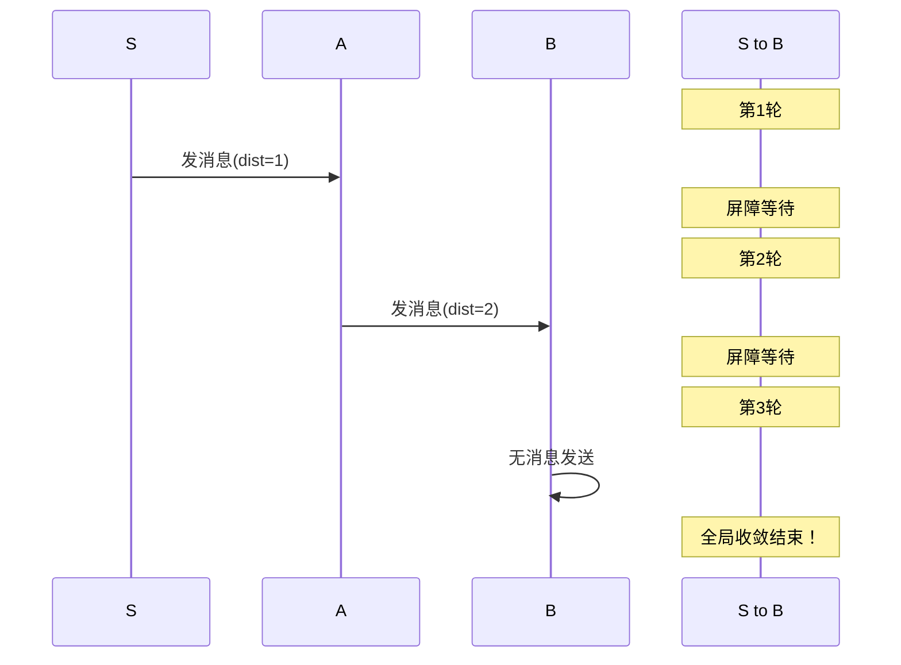

用最简单无向图演示Pregel SSSP，**一步一步**看每一轮发生了什么。

## 超简单图：3个点

## 第1轮：只有S激活

**发生了什么**：
- S知道自己是源点，设置`dist=0`
- S给邻居A发消息：`"我距离源点是0，你到源点是0+1=1"`
- S觉得自己完了，**voteToHalt（休眠）**
- **屏障等待**：所有worker同步

## 第2轮：A收到消息激活

/* 注：箭头内容使用 -- 发消息(dist=2) -->，表示 A2 向 B2 发送消息，休眠用虚线自环 */

**发生了什么**：
- A收到S的消息：`"你到源点是1"`
- A更新`dist=1`，给B发消息：`"你到源点是1+1=2"`
- A休眠
- **屏障等待**

## 第3轮：B收到消息

**发生了什么**：
- B收到A的消息：`"你到源点是2"`
- B更新`dist=2`
- B没有邻居要通知，**休眠**
- **本轮无新消息** + **所有点都休眠** → **算法结束！**

## 轮次时间轴

**核心规律**：
1. **每轮只处理上一轮的消息**
2. **活跃点并行计算** → **发下一轮消息** → **全图屏障同步**
3. **没人发消息+全休眠** = 结束