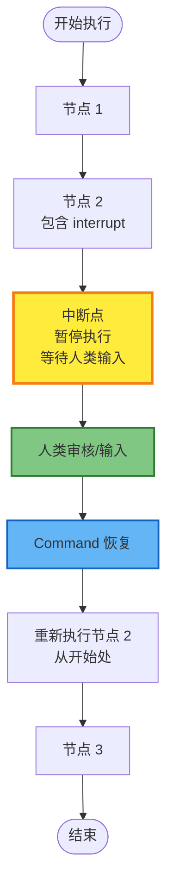

# LangGraph 人类介入决策系统（Human-in-the-Loop）详解

## 目录

1. [概述](#概述)
2. [核心概念](#核心概念)
3. [工作原理](#工作原理)
4. [基本使用](#基本使用)
5. [常见模式](#常见模式)
6. [实际应用场景](#实际应用场景)
7. [代码示例](#代码示例)
8. [注意事项和最佳实践](#注意事项和最佳实践)

---

## 概述

人类介入决策系统（Human-in-the-Loop，HIL）是 LangGraph 的一个强大功能，允许在图的执行过程中暂停执行，等待人类输入、审核或决策，然后基于人类的反馈继续执行。这对于需要人工审核、编辑或决策的 AI 应用场景至关重要。

### 为什么需要人类介入？

在 AI 驱动的应用中，以下场景通常需要人类介入：

1. **关键操作审核**：在执行敏感操作（如 API 调用、数据修改）前需要人工审核
2. **输出质量保证**：LLM 生成的输出可能需要人工检查和编辑
3. **决策指导**：在关键决策点需要人类提供指导或选择
4. **错误纠正**：当 AI 输出不符合要求时，需要人类提供反馈和修正
5. **上下文补充**：需要人类提供额外的上下文信息

### 核心优势

- **持久化执行状态**：使用 checkpointing 机制，可以无限期暂停执行，支持异步人工审核
- **灵活集成点**：可以在工作流的任意位置引入人类介入逻辑
- **状态恢复**：从暂停点精确恢复，不丢失已执行的工作
- **多中断支持**：支持并行节点中的多个中断点

---

## 核心概念

### Interrupt（中断）

**Interrupt** 是暂停图执行的核心机制。当在节点中调用 `interrupt()` 函数时，图的执行会暂停，等待人类输入。

#### 动态中断 vs 静态中断

LangGraph 支持两种类型的中断：

1. **动态中断（Dynamic Interrupts）**：
   - 使用 `interrupt()` 函数在节点内部触发
   - 基于图的当前状态动态决定是否中断
   - **推荐用于生产环境的人类介入工作流**

2. **静态中断（Static Interrupts）**：
   - 使用 `interrupt_before` 和 `interrupt_after` 在编译时或运行时设置
   - 在特定节点执行前或后暂停
   - **主要用于调试和测试，不推荐用于生产环境**

### Command（命令）

**Command** 是恢复图执行的原语。当图被中断后，使用 `Command` 提供人类输入来恢复执行。

`Command` 支持以下操作：

- `resume`：提供恢复值，继续执行
- `goto`：跳转到指定节点
- `update`：更新图的状态

### Checkpointer（检查点保存器）

**Checkpointer** 是启用人类介入功能的前提条件。它负责：

- 在每个步骤后保存图的状态
- 持久化执行上下文
- 支持从任意检查点恢复执行

---

## 工作原理

### 执行流程



### 关键机制

1. **状态持久化**：
   - 当遇到 `interrupt()` 时，图的当前状态被保存到 checkpoint
   - 状态包括所有通道的值、版本信息、元数据等

2. **节点重新执行**：
   - ⚠️ **重要**：恢复执行时，会从**节点的开始处**重新执行整个节点
   - 这与 Python 的 `input()` 函数不同，`input()` 会从调用点继续执行
   - 因此，建议将 `interrupt()` 放在节点开始处或使用专用节点

3. **恢复值匹配**：
   - 如果节点中有多个 `interrupt()` 调用，恢复值按顺序匹配
   - 匹配是基于索引的，所以节点结构必须保持稳定

---

## 基本使用

### 1. 设置 Checkpointer

首先需要配置一个 checkpointer：

```python
from langgraph.checkpoint.memory import InMemorySaver

# 开发环境：使用内存保存器
checkpointer = InMemorySaver()

# 生产环境：使用数据库保存器
# from langgraph.checkpoint.postgres import PostgresSaver
# checkpointer = PostgresSaver.from_conn_string("postgresql://...")
```

### 2. 在节点中使用 interrupt

```python
from langgraph.types import interrupt, Command
from langgraph.graph import StateGraph, START, END
from typing_extensions import TypedDict

class State(TypedDict):
    text: str
    human_input: str

def human_node(state: State):
    # 中断执行，等待人类输入
    value = interrupt({
        "prompt": "请审核以下文本：",
        "text_to_review": state["text"]
    })
    
    # 恢复执行后，interrupt() 返回人类提供的值
    return {"human_input": value}

# 构建图
workflow = StateGraph(State)
workflow.add_node("human_node", human_node)
workflow.add_edge(START, "human_node")
workflow.add_edge("human_node", END)

# 编译时指定 checkpointer
graph = workflow.compile(checkpointer=checkpointer)
```

### 3. 执行图并处理中断

```python
import uuid

# 配置 thread_id（用于标识执行会话）
config = {"configurable": {"thread_id": str(uuid.uuid4())}}

# 执行图直到遇到中断
result = graph.invoke({"text": "原始文本"}, config=config)

# 检查是否有中断
if "__interrupt__" in result:
    print("图已中断，等待人类输入")
    print("中断信息：", result["__interrupt__"])
    
    # 获取中断详情
    interrupts = result["__interrupt__"]
    for interrupt_info in interrupts:
        print(f"中断值：{interrupt_info.value}")
        print(f"中断 ID：{interrupt_info.id}")
```

### 4. 恢复执行

```python
# 使用 Command 提供人类输入并恢复执行
human_response = {
    "approved": True,
    "edited_text": "修改后的文本"
}

final_result = graph.invoke(
    Command(resume=human_response),
    config=config
)

print("最终结果：", final_result)
```

### 完整示例

```python
from typing_extensions import TypedDict
import uuid
from langgraph.checkpoint.memory import InMemorySaver
from langgraph.graph import StateGraph, START, END
from langgraph.types import interrupt, Command

class State(TypedDict):
    original_text: str
    reviewed_text: str

def review_node(state: State):
    """人工审核节点"""
    # 中断执行，展示需要审核的内容
    response = interrupt({
        "task": "请审核并编辑以下文本",
        "text": state["original_text"]
    })
    
    # 恢复后，response 包含人类的输入
    return {"reviewed_text": response["edited_text"]}

def process_node(state: State):
    """处理审核后的文本"""
    print(f"处理文本：{state['reviewed_text']}")
    return state

# 构建图
workflow = StateGraph(State)
workflow.add_node("review", review_node)
workflow.add_node("process", process_node)
workflow.add_edge(START, "review")
workflow.add_edge("review", "process")
workflow.add_edge("process", END)

# 编译
checkpointer = InMemorySaver()
graph = workflow.compile(checkpointer=checkpointer)

# 执行
config = {"configurable": {"thread_id": str(uuid.uuid4())}}
result = graph.invoke({"original_text": "这是一段需要审核的文本"}, config=config)

# 检查中断
if "__interrupt__" in result:
    print("等待人工审核...")
    interrupt_info = result["__interrupt__"][0]
    print(f"需要审核的文本：{interrupt_info.value['text']}")
    
    # 模拟人类输入
    human_input = {
        "edited_text": "这是一段已经审核并修改的文本"
    }
    
    # 恢复执行
    final_result = graph.invoke(Command(resume=human_input), config=config)
    print(f"最终结果：{final_result}")
```

---

## 常见模式

### 模式 1：批准或拒绝（Approve or Reject）

在关键步骤前暂停，等待人类批准或拒绝，然后根据决策路由到不同路径。

```python
from typing import Literal
from langgraph.types import interrupt, Command

def approval_node(state: State) -> Command[Literal["approved_path", "rejected_path"]]:
    """人工批准节点"""
    decision = interrupt({
        "question": "是否批准执行以下操作？",
        "action": state["proposed_action"],
        "details": state["action_details"]
    })
    
    if decision == "approve":
        return Command(
            goto="approved_path",
            update={"status": "approved"}
        )
    else:
        return Command(
            goto="rejected_path",
            update={"status": "rejected"}
        )

# 使用示例
workflow = StateGraph(State)
workflow.add_node("approval", approval_node)
workflow.add_node("approved_path", approved_handler)
workflow.add_node("rejected_path", rejected_handler)

# 执行
result = graph.invoke({"proposed_action": "发送邮件"}, config=config)

# 如果中断，提供批准决策
if "__interrupt__" in result:
    # 批准
    graph.invoke(Command(resume="approve"), config=config)
    # 或拒绝
    # graph.invoke(Command(resume="reject"), config=config)
```

**应用场景**：
- API 调用前的审核
- 敏感操作的批准流程
- 内容发布前的审核

### 模式 2：审核和编辑状态（Review and Edit State）

暂停执行，允许人类查看和编辑图的状态。

```python
def edit_node(state: State):
    """编辑节点"""
    result = interrupt({
        "task": "请审核并编辑以下内容",
        "llm_output": state["llm_generated_summary"],
        "current_state": state
    })
    
    # 更新状态
    return {
        "llm_generated_summary": result["edited_text"],
        "last_edited_by": result.get("editor", "unknown")
    }
```

**应用场景**：
- LLM 生成内容的审核和编辑
- 数据修正
- 状态更新

### 模式 3：审核工具调用（Review Tool Calls）

在执行工具调用前暂停，允许人类审核、编辑或拒绝工具调用。

```python
from langgraph.prebuilt import create_react_agent
from langgraph.checkpoint.memory import InMemorySaver

def book_hotel(hotel_name: str):
    """预订酒店工具（需要人工审核）"""
    # 中断执行，展示工具调用信息
    response = interrupt({
        "tool_name": "book_hotel",
        "args": {"hotel_name": hotel_name},
        "message": f"准备预订酒店：{hotel_name}，请审核或编辑参数"
    })
    
    if response["type"] == "accept":
        # 使用原始参数
        pass
    elif response["type"] == "edit":
        # 使用编辑后的参数
        hotel_name = response["args"]["hotel_name"]
    elif response["type"] == "reject":
        raise ValueError("工具调用被拒绝")
    
    # 执行实际的工具调用
    return f"成功预订酒店：{hotel_name}"

# 创建带有人类介入的代理
checkpointer = InMemorySaver()
agent = create_react_agent(
    model="anthropic:claude-3-5-sonnet-latest",
    tools=[book_hotel],
    checkpointer=checkpointer
)

# 执行代理
config = {"configurable": {"thread_id": "1"}}
for chunk in agent.stream(
    {"messages": [{"role": "user", "content": "预订 McKittrick 酒店"}]},
    config=config
):
    print(chunk)

# 如果中断，提供审核结果
# 批准
agent.invoke(Command(resume={"type": "accept"}), config=config)
# 编辑参数
# agent.invoke(Command(resume={"type": "edit", "args": {"hotel_name": "McKittrick Hotel"}}), config=config)
```

**应用场景**：
- 敏感工具调用（支付、删除、修改）
- 需要参数验证的工具调用
- 成本较高的 API 调用

### 模式 4：验证人类输入（Validate Human Input）

在节点内部使用循环和多个 `interrupt()` 调用来验证人类输入。

```python
def validate_input_node(state: State):
    """验证人类输入的节点"""
    prompt = "请输入您的年龄（必须是非负整数）："
    
    while True:
        user_input = interrupt(prompt)
        
        # 验证输入
        try:
            age = int(user_input)
            if age < 0:
                raise ValueError("年龄必须是非负数")
            break  # 输入有效，退出循环
        except (ValueError, TypeError):
            prompt = f"'{user_input}' 无效。请输入一个非负整数："
    
    return {"age": age}
```

**应用场景**：
- 表单输入验证
- 数据格式检查
- 业务规则验证

---

## 实际应用场景

### 场景 1：内容审核工作流

```python
class ContentState(TypedDict):
    user_input: str
    llm_generated: str
    human_reviewed: str
    status: str  # "pending", "approved", "rejected"

def generate_content(state: ContentState):
    """LLM 生成内容"""
    # 模拟 LLM 生成
    generated = f"基于 '{state['user_input']}' 生成的内容"
    return {"llm_generated": generated, "status": "pending"}

def human_review(state: ContentState):
    """人工审核"""
    review_result = interrupt({
        "task": "请审核以下 LLM 生成的内容",
        "original_input": state["user_input"],
        "generated_content": state["llm_generated"],
        "options": ["approve", "edit", "reject"]
    })
    
    if review_result["action"] == "approve":
        return {
            "human_reviewed": state["llm_generated"],
            "status": "approved"
        }
    elif review_result["action"] == "edit":
        return {
            "human_reviewed": review_result["edited_content"],
            "status": "approved"
        }
    else:  # reject
        return {"status": "rejected"}

def publish_content(state: ContentState):
    """发布内容"""
    if state["status"] == "approved":
        print(f"发布内容：{state['human_reviewed']}")
    return state

# 构建工作流
workflow = StateGraph(ContentState)
workflow.add_node("generate", generate_content)
workflow.add_node("review", human_review)
workflow.add_node("publish", publish_content)
workflow.add_edge(START, "generate")
workflow.add_edge("generate", "review")
workflow.add_edge("review", "publish")
workflow.add_edge("publish", END)
```

### 场景 2：多步骤审批流程

```python
class ApprovalState(TypedDict):
    request: dict
    approvers: list[str]
    current_approver: str
    approvals: dict[str, bool]
    status: str

def get_next_approver(state: ApprovalState):
    """获取下一个审批人"""
    for approver in state["approvers"]:
        if approver not in state.get("approvals", {}):
            return {"current_approver": approver}
    return {"status": "all_approved"}

def request_approval(state: ApprovalState):
    """请求审批"""
    approver = state["current_approver"]
    decision = interrupt({
        "to": approver,
        "request": state["request"],
        "message": f"请审批以下请求",
        "options": ["approve", "reject"]
    })
    
    approvals = state.get("approvals", {})
    approvals[approver] = decision == "approve"
    
    return {
        "approvals": approvals,
        "status": "pending" if decision == "approve" else "rejected"
    }
```

### 场景 3：交互式数据收集

```python
class DataCollectionState(TypedDict):
    collected_data: dict
    current_field: str
    fields_to_collect: list[str]

def collect_field(state: DataCollectionState):
    """收集单个字段"""
    fields = state["fields_to_collect"]
    collected = state.get("collected_data", {})
    
    # 找到下一个未收集的字段
    for field in fields:
        if field not in collected:
            value = interrupt({
                "field": field,
                "prompt": f"请输入 {field}：",
                "collected_so_far": collected
            })
            collected[field] = value
            return {
                "collected_data": collected,
                "current_field": field
            }
    
    return {"status": "complete"}
```

---

## 代码示例

### 示例 1：基本人类介入流程

```python
from typing_extensions import TypedDict
import uuid
from langgraph.checkpoint.memory import InMemorySaver
from langgraph.graph import StateGraph, START, END
from langgraph.types import interrupt, Command

class State(TypedDict):
    input_text: str
    human_feedback: str
    final_output: str

def process_input(state: State):
    """处理输入"""
    return {"processed": f"处理后的：{state['input_text']}"}

def get_human_feedback(state: State):
    """获取人类反馈"""
    feedback = interrupt({
        "processed_text": state.get("processed", ""),
        "question": "请提供反馈或编辑建议"
    })
    return {"human_feedback": feedback}

def apply_feedback(state: State):
    """应用反馈"""
    return {"final_output": state["human_feedback"]}

# 构建图
workflow = StateGraph(State)
workflow.add_node("process", process_input)
workflow.add_node("feedback", get_human_feedback)
workflow.add_node("apply", apply_feedback)

workflow.add_edge(START, "process")
workflow.add_edge("process", "feedback")
workflow.add_edge("feedback", "apply")
workflow.add_edge("apply", END)

# 编译和执行
checkpointer = InMemorySaver()
graph = workflow.compile(checkpointer=checkpointer)

config = {"configurable": {"thread_id": str(uuid.uuid4())}}
result = graph.invoke({"input_text": "原始文本"}, config=config)

# 处理中断
if "__interrupt__" in result:
    human_input = "这是人类的反馈"
    final = graph.invoke(Command(resume=human_input), config=config)
    print(final)
```

### 示例 2：并行中断处理

```python
from typing_extensions import TypedDict
import uuid
from langgraph.checkpoint.memory import InMemorySaver
from langgraph.graph import StateGraph, START, END
from langgraph.types import interrupt, Command

class State(TypedDict):
    text_1: str
    text_2: str
    reviewed_1: str
    reviewed_2: str

def review_text_1(state: State):
    """审核文本 1"""
    value = interrupt({"text_to_review": state["text_1"], "id": "text_1"})
    return {"reviewed_1": value}

def review_text_2(state: State):
    """审核文本 2"""
    value = interrupt({"text_to_review": state["text_2"], "id": "text_2"})
    return {"reviewed_2": value}

# 构建并行图
workflow = StateGraph(State)
workflow.add_node("review_1", review_text_1)
workflow.add_node("review_2", review_text_2)

# 两个节点并行执行
workflow.add_edge(START, "review_1")
workflow.add_edge(START, "review_2")

checkpointer = InMemorySaver()
graph = workflow.compile(checkpointer=checkpointer)

config = {"configurable": {"thread_id": str(uuid.uuid4())}}
result = graph.invoke({
    "text_1": "文本 1",
    "text_2": "文本 2"
}, config=config)

# 处理多个中断
if "__interrupt__" in result:
    # 获取所有中断
    state = graph.get_state(config)
    interrupts = state.interrupts
    
    # 创建恢复映射
    resume_map = {
        interrupt.id: f"已审核 {interrupt.value['id']}"
        for interrupt in interrupts
    }
    
    # 一次性恢复所有中断
    final = graph.invoke(Command(resume=resume_map), config=config)
    print(final)
```

### 示例 3：条件中断

```python
def conditional_interrupt_node(state: State):
    """根据条件决定是否中断"""
    # 只有在满足某些条件时才中断
    if state.get("requires_review", False):
        decision = interrupt({
            "message": "此内容需要人工审核",
            "content": state["content"]
        })
        return {"reviewed_content": decision}
    else:
        # 自动通过
        return {"reviewed_content": state["content"]}
```

---

## 注意事项和最佳实践

### 1. 节点重新执行

⚠️ **重要**：恢复执行时，会从节点的**开始处**重新执行整个节点。

**最佳实践**：
- 将 `interrupt()` 放在节点开始处
- 或将需要中断的逻辑放在专用节点中
- 避免在 `interrupt()` 之前放置有副作用的代码（如 API 调用）

```python
# ✅ 推荐：interrupt 在节点开始
def good_node(state: State):
    value = interrupt("请输入值")
    api_call(value)  # API 调用在 interrupt 之后
    return {"result": "success"}

# ❌ 不推荐：有副作用的代码在 interrupt 之前
def bad_node(state: State):
    api_call()  # 这会重复执行！
    value = interrupt("请输入值")
    return {"result": value}
```

### 2. 多个中断的处理

如果节点中有多个 `interrupt()` 调用：

- 恢复值按**顺序**匹配（基于索引）
- 节点结构必须保持稳定
- 避免动态改变中断的数量或顺序

```python
# ✅ 推荐：稳定的中断结构
def stable_node(state: State):
    name = interrupt("请输入姓名")
    age = interrupt("请输入年龄")
    return {"name": name, "age": age}

# ❌ 不推荐：动态改变中断结构
def unstable_node(state: State):
    if condition:
        name = interrupt("请输入姓名")
    age = interrupt("请输入年龄")  # 索引可能不匹配
    return {"name": name, "age": age}
```

### 3. 副作用处理

对于有副作用的代码（API 调用、文件操作等）：

**方案 1**：放在 `interrupt()` 之后
```python
def node_with_side_effect(state: State):
    approval = interrupt("是否批准？")
    if approval:
        make_api_call()  # 在 interrupt 之后
    return {"status": "done"}
```

**方案 2**：放在单独的节点中
```python
def approval_node(state: State):
    approval = interrupt("是否批准？")
    return {"approved": approval}

def api_node(state: State):
    if state["approved"]:
        make_api_call()  # 在单独的节点中
    return {"status": "done"}
```

### 4. 子图的中断

当子图包含中断时：

- 父图会从调用子图的节点开始重新执行
- 子图会从包含中断的节点开始重新执行
- 已执行的节点不会重新执行（由于 checkpointing）

### 5. Checkpointer 选择

- **开发/测试**：使用 `InMemorySaver`
- **生产环境**：使用 `PostgresSaver` 或 `SqliteSaver`
- 确保 checkpointer 支持持久化存储

### 6. Thread ID 管理

- 每个执行会话需要唯一的 `thread_id`
- 使用 UUID 生成唯一 ID
- 相同 `thread_id` 可以恢复之前的执行状态

```python
import uuid

# 生成唯一 thread_id
config = {"configurable": {"thread_id": str(uuid.uuid4())}}

# 或使用有意义的 ID（如用户 ID + 会话 ID）
config = {"configurable": {"thread_id": f"user_{user_id}_session_{session_id}"}}
```

### 7. 错误处理

```python
def robust_node(state: State):
    try:
        value = interrupt("请输入值")
        # 处理值
        return {"value": value}
    except Exception as e:
        # 处理中断相关的错误
        return {"error": str(e)}
```

### 8. 超时和取消

虽然 LangGraph 支持无限期暂停，但在实际应用中可能需要：

- 设置超时机制（在应用层实现）
- 提供取消功能
- 记录中断的持续时间

---

## 总结

LangGraph 的人类介入决策系统提供了强大的能力来构建需要人工审核、编辑或决策的 AI 应用：

1. **核心机制**：使用 `interrupt()` 暂停执行，使用 `Command` 恢复执行
2. **状态持久化**：通过 checkpointing 实现无限期暂停和精确恢复
3. **灵活集成**：可以在工作流的任意位置引入人类介入
4. **多种模式**：支持批准/拒绝、编辑、审核、验证等多种模式

通过合理使用这些功能，可以构建更加可靠、可控、符合业务需求的 AI 应用系统。

---

## 相关资源

- [Checkpointing 详解](./CHECKPOINTING_EXPLANATION.md)
- [LangGraph 官方文档](https://langchain-ai.github.io/langgraph/)
- [Human-in-the-Loop 概念指南](https://langchain-ai.github.io/langgraph/concepts/human_in_the_loop/)
