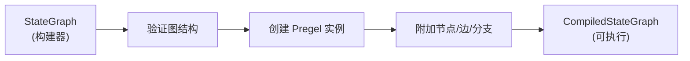

## StateGraph 为什么需要 compile 方法进行编译

`StateGraph` 中的 `compile` 方法是必需的，因为 `StateGraph` 只是一个构建器类，不能直接用于执行 [1](#1-0) 。

### 主要原因

1. **从构建器到可执行对象的转换**
   - `StateGraph` 用于定义图结构（添加节点、边等）
   - `compile` 将其转换为 `CompiledStateGraph`，后者实现了 `Runnable` 接口，支持 `invoke()`、`stream()` 等执行方法 [2](#1-1) 

2. **图结构验证**
   - 编译时验证图的结构完整性
   - 检查是否有孤儿节点
   - 确保有入口点（从 START 到其他节点的边） [3](#1-2) 

3. **运行时配置**
   - 配置检查点保存器（checkpointer）用于持久化
   - 设置中断点（interrupt_before/interrupt_after）
   - 配置存储（store）和缓存（cache） [4](#1-3) 

4. **内部结构准备**
   - 准备输出通道和流通道
   - 创建 `Pregel` 执行引擎实例
   - 附加所有节点、边和分支到编译后的图 [5](#1-4) 

### 编译过程



编译后的 `CompiledStateGraph` 继承自 `Pregel`，这是 LangGraph 的核心执行引擎，使用超步（super-step）模型执行图 [6](#1-5) 。

## Notes

- 必须调用 `compile()` 才能使用图，否则会报错 [7](#1-6) 
- 编译是一个轻量级操作，主要是验证和配置，不会执行节点逻辑
- 同一个 `StateGraph` 可以多次编译，每次可以使用不同的运行时配置

Wiki pages you might want to explore:
- [Core Execution System (langchain-ai/langgraph)](/wiki/langchain-ai/langgraph#3)

### Citations

**File:** libs/langgraph/langgraph/graph/state.py (L120-126)
```python
    !!! warning

        `StateGraph` is a builder class and cannot be used directly for execution.
        You must first call `.compile()` to create an executable graph that supports
        methods like `invoke()`, `stream()`, `astream()`, and `ainvoke()`. See the
        `CompiledStateGraph` documentation for more details.

```

**File:** libs/langgraph/langgraph/graph/state.py (L774-791)
```python
    def validate(self, interrupt: Sequence[str] | None = None) -> Self:
        # assemble sources
        all_sources = {src for src, _ in self._all_edges}
        for start, branches in self.branches.items():
            all_sources.add(start)
        for name, spec in self.nodes.items():
            if spec.ends:
                all_sources.add(name)
        # validate sources
        for source in all_sources:
            if source not in self.nodes and source != START:
                raise ValueError(f"Found edge starting at unknown node '{source}'")

        if START not in all_sources:
            raise ValueError(
                "Graph must have an entrypoint: add at least one edge from START to another node"
            )

```

**File:** libs/langgraph/langgraph/graph/state.py (L823-833)
```python
    def compile(
        self,
        checkpointer: Checkpointer = None,
        *,
        cache: BaseCache | None = None,
        store: BaseStore | None = None,
        interrupt_before: All | list[str] | None = None,
        interrupt_after: All | list[str] | None = None,
        debug: bool = False,
        name: str | None = None,
    ) -> CompiledStateGraph[StateT, ContextT, InputT, OutputT]:
```

**File:** libs/langgraph/langgraph/graph/state.py (L834-838)
```python
        """Compiles the `StateGraph` into a `CompiledStateGraph` object.

        The compiled graph implements the `Runnable` interface and can be invoked,
        streamed, batched, and run asynchronously.

```

**File:** libs/langgraph/langgraph/graph/state.py (L869-926)
```python
        # prepare output channels
        output_channels = (
            "__root__"
            if len(self.schemas[self.output_schema]) == 1
            and "__root__" in self.schemas[self.output_schema]
            else [
                key
                for key, val in self.schemas[self.output_schema].items()
                if not is_managed_value(val)
            ]
        )
        stream_channels = (
            "__root__"
            if len(self.channels) == 1 and "__root__" in self.channels
            else [
                key for key, val in self.channels.items() if not is_managed_value(val)
            ]
        )

        compiled = CompiledStateGraph[StateT, ContextT, InputT, OutputT](
            builder=self,
            schema_to_mapper={},
            context_schema=self.context_schema,
            nodes={},
            channels={
                **self.channels,
                **self.managed,
                START: EphemeralValue(self.input_schema),
            },
            input_channels=START,
            stream_mode="updates",
            output_channels=output_channels,
            stream_channels=stream_channels,
            checkpointer=checkpointer,
            interrupt_before_nodes=interrupt_before,
            interrupt_after_nodes=interrupt_after,
            auto_validate=False,
            debug=debug,
            store=store,
            cache=cache,
            name=name or "LangGraph",
        )

        compiled.attach_node(START, None)
        for key, node in self.nodes.items():
            compiled.attach_node(key, node)

        for start, end in self.edges:
            compiled.attach_edge(start, end)

        for starts, end in self.waiting_edges:
            compiled.attach_edge(starts, end)

        for start, branches in self.branches.items():
            for name, branch in branches.items():
                compiled.attach_branch(start, name, branch)

        return compiled.validate()
```

**File:** libs/langgraph/langgraph/graph/state.py (L929-933)
```python
class CompiledStateGraph(
    Pregel[StateT, ContextT, InputT, OutputT],
    Generic[StateT, ContextT, InputT, OutputT],
):
    builder: StateGraph[StateT, ContextT, InputT, OutputT]
```

**File:** docs/docs/concepts/low_level.md (L56-56)
```markdown
You **MUST** compile your graph before you can use it.
```
